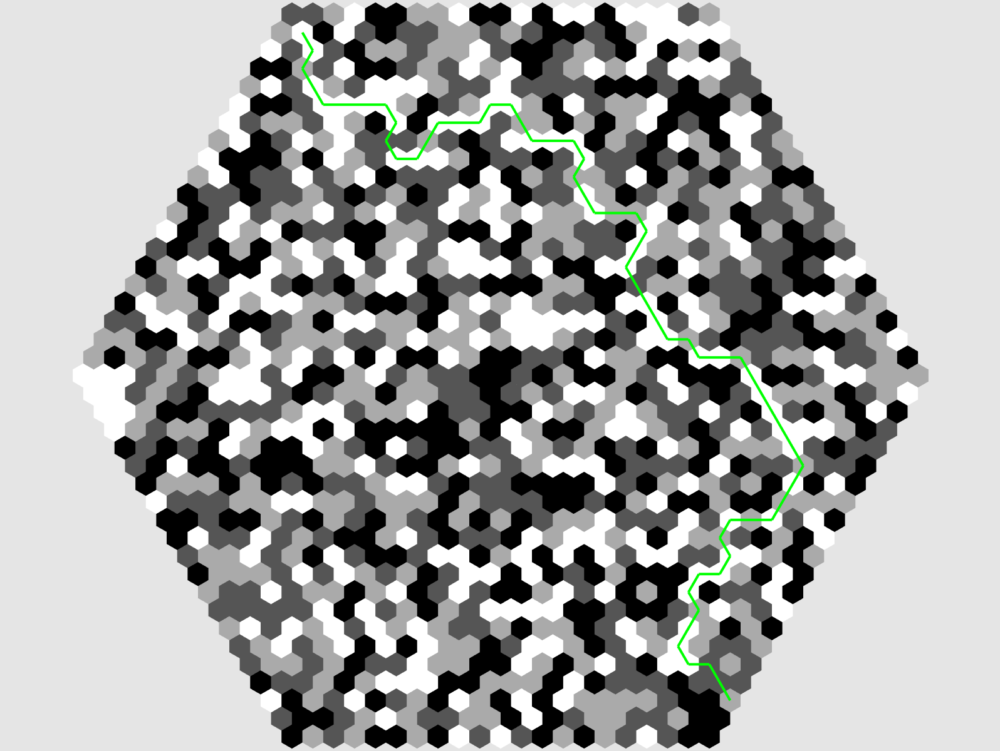

# Honeycomb

---

A library for working with hexagonal grids in rust. [This article](https://www.redblobgames.com/grids/hexagons/) from Red Blob Games is used as reference for many of the algorithms used here.



---

## Running Examples

You can run examples by running:
```bash
cargo run --example <name>
```
where you replace ```<name>``` with the example that you wish to run.